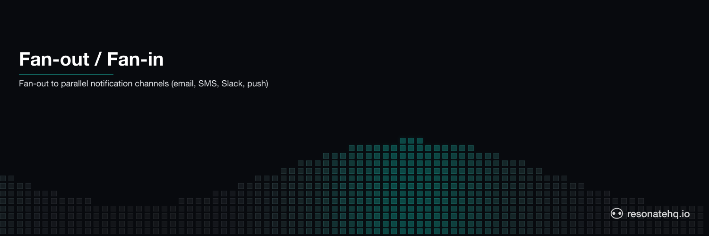

<p align="center">
  <picture>
    <source media="(prefers-color-scheme: dark)" srcset="./assets/banner-dark.png">
    <source media="(prefers-color-scheme: light)" srcset="./assets/banner-light.png">
    
  </picture>
</p>

# Fan-Out / Fan-In

Parallel notification delivery with crash recovery. When an order is confirmed, notify the customer simultaneously through all four channels — email, SMS, Slack, and push notification. Total time equals the slowest channel, not the sum.

## What This Demonstrates

- **Fan-out pattern**: one event triggers N parallel operations simultaneously
- **Fan-in pattern**: collect all results after parallel execution completes
- **Partial failure handling**: if push service is down, email/SMS/Slack complete unaffected
- **No re-sends on retry**: if push retries, the other 3 channels are already checkpointed

## How It Works

`beginRun()` starts each notification channel without blocking. All four start at the same time. The workflow fan-in collects results in order:

```typescript
// Fan-out: start all simultaneously
const emailFuture = yield* ctx.beginRun(sendEmail, event);
const smsFuture   = yield* ctx.beginRun(sendSms, event);
const slackFuture = yield* ctx.beginRun(sendSlack, event);
const pushFuture  = yield* ctx.beginRun(sendPush, event, simulateCrash);

// Fan-in: collect results
const results = [
  yield* emailFuture,
  yield* smsFuture,
  yield* slackFuture,
  yield* pushFuture,
];
```

Each `yield*` is a checkpoint. If push fails and Resonate retries it, email/SMS/Slack results are already stored — they don't re-execute.

## Prerequisites

- [Bun](https://bun.sh) v1.0+

No external services required. Resonate runs in embedded mode.

## Setup

```bash
git clone https://github.com/resonatehq-examples/example-fan-out-fan-in-ts
cd example-fan-out-fan-in-ts
bun install
```

## Run It

**Happy path** — all 4 channels in parallel:
```bash
bun start
```

```
=== Fan-Out / Fan-In Notification Demo ===
Mode: HAPPY PATH (all 4 channels in parallel)

Order ord_... confirmed — notifying customer user_alice...

  [email]   Sending order confirmation to user user_alice...
  [sms]     Sending SMS to user user_alice...
  [slack]   Posting to #orders channel...
  [push]    Sending push notification to user user_alice (attempt 1)...
  [push]    Delivered — msg_push_6ic2ee
  [slack]   Posted — msg_slack_7vqmw6
  [sms]     Sent — msg_sms_jmp3ig
  [email]   Sent — msg_email_73bklg

=== Result ===
Channels notified: 4/4
Wall time: 418ms

Channel timings:
  email  401ms  msg_email_...
  sms    251ms  msg_sms_...
  slack  180ms  msg_slack_...
  push   121ms  msg_push_...

Fan-out time:   418ms
Sequential est: 953ms
Speedup:        2.3x
```

**Crash mode** — push service down on first attempt, other channels unaffected:
```bash
bun start:crash
```

```
  [email]   Sending order confirmation to user user_alice...
  [sms]     Sending SMS to user user_alice...
  [slack]   Posting to #orders channel...
  [push]    Sending push notification to user user_alice (attempt 1)...
Runtime. Function 'sendPush' failed with 'Error: Push service unavailable — will retry' (retrying in 2 secs)
  [slack]   Posted — msg_slack_...
  [sms]     Sent — msg_sms_...
  [email]   Sent — msg_email_...
  [push]    Sending push notification to user user_alice (attempt 2)...
  [push]    Delivered — msg_push_...
```

## What to Observe

1. **Parallel start**: all four `[channel]   Sending...` lines appear before any completion lines — they start concurrently.
2. **Completion order**: channels complete in latency order (push 121ms, slack 180ms, sms 250ms, email 400ms), not submission order.
3. **Speedup**: 418ms total vs 953ms sequential — roughly the latency of the slowest single channel.
4. **Partial failure**: in crash mode, email/SMS/Slack complete first. Push fails, retries, succeeds. The others are NOT re-sent.

## The Code

The workflow is 25 lines in [`src/workflow.ts`](src/workflow.ts):

```typescript
export function* notifyAll(ctx: Context, event: OrderEvent, simulateCrash: boolean) {
  const start = Date.now();

  const emailFuture = yield* ctx.beginRun(sendEmail, event);
  const smsFuture   = yield* ctx.beginRun(sendSms, event);
  const slackFuture = yield* ctx.beginRun(sendSlack, event);
  const pushFuture  = yield* ctx.beginRun(sendPush, event, simulateCrash);

  const results = [
    yield* emailFuture,
    yield* smsFuture,
    yield* slackFuture,
    yield* pushFuture,
  ];

  return { channelsNotified: results.filter(r => r.success).length, ... };
}
```

## File Structure

```
example-fan-out-fan-in-ts/
├── src/
│   ├── index.ts      Entry point — Resonate setup and demo runner
│   ├── workflow.ts   Fan-out/fan-in workflow — 25 lines
│   └── channels.ts   Channel implementations — email, SMS, Slack, push
├── package.json
└── tsconfig.json
```

**Lines of code**: ~155 total, ~25 lines of workflow logic.

## One API for one or many

`beginRun()` is the same call whether you're running one branch or a hundred. There is no special "parallel" mode to flip, no DAG declaration, no child-workflow boilerplate. The fan-in is `yield* future` — awaiting the handle returned by `beginRun()` — and partial failure is handled per-step via the promise store: a branch that succeeded checkpoints its result; a branch that failed retries independently.

## Learn More

- [Resonate documentation](https://docs.resonatehq.io)
